<h1 align="left">Software Engineer</h1>

Full Stack Software Engineer focused on building scalable web applications, SaaS products, and modern digital experiences.

Currently working with React, TypeScript, Node.js, and GraphQL in production environments, contributing to large-scale e-commerce applications and headless commerce architectures.

Outside of work, I build SaaS products and backend services, with a growing focus on Java, Spring Boot, cloud technologies, and software architecture.

Building software products that combine technical scalability with real business impact.

  
  

 

## Current Focus

* Backend development with **Java and Spring Boot**
* Scalable frontend applications with **React and TypeScript**
* Cloud-native and containerized environments with **Docker and AWS**
* Software architecture, API design, and distributed systems

## Stats

  
  

## Tech Stack

 

## Featured Projects

### GoMech

SaaS platform for mechanical workshop management, focused on operational automation, business management, and intelligent workflows.

### Alerta360

Real-time monitoring platform for environmental sensors, built with Java and Spring Boot.

 

## Engineering Interests

* Backend architecture and distributed systems
* API design and integrations
* Product engineering and SaaS development
* Database design and performance optimization
* Cloud-native application development

 

<picture>
  <source
    media="(prefers-color-scheme: dark)"
    srcset="https://raw.githubusercontent.com/DeyvidJesus/DeyvidJesus/output/github-contribution-grid-snake-dark.svg"
  />
  <source
    media="(prefers-color-scheme: light)"
    srcset="https://raw.githubusercontent.com/DeyvidJesus/DeyvidJesus/output/github-contribution-grid-snake.svg"
  />
  
</picture>
